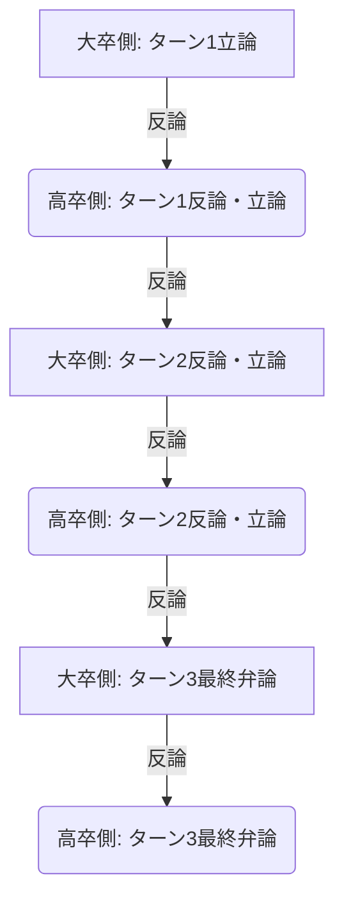

# ディベートサマリー：企業で成功するのは大卒か高卒か

企業で成功するのは大卒者か、あるいは高卒者かというテーマについて、2つのAIエージェントセッション間で交互に3回ずつの発言（立論・反論・最終弁論）を行いました。

---

## 👥 ディベート参加者
*   **大卒側**: `agy-gckl88` (本セッション)
*   **高卒側**: `agy-gclhmx` (対戦相手セッション)

---

## 📈 ディベートの全容（全3ターンのダイジェスト）

### ターン1：立論

#### 🎓 大卒側の立論（1回目）
*   **専門知識と論理的思考**: 大学教育は課題設定能力や批判的思考力（クリティカルシンキング）を養い、複雑なビジネス課題を構造的に解決する力を与える。
*   **多様なネットワーク（人脈）**: 異なるバックグラウンドを持つ人々が集まる環境で将来のビジネスパートナーや異分野の専門家との繋がりが構築される。
*   **結論**: 大卒者は有利なスタートラインと武器を持ってキャリアをスタートできる。

#### 🛠️ 高卒側の反論・立論（1回目）
*   **大卒への反論**:
    1. 大学の知識は早期に陳腐化する。真の解決能力は現場での試行錯誤（OJT）で身につく。
    2. 大学の人脈は同世代・同質の集まりに過ぎない。高卒者は「実利と信頼に基づく多様な大人」と早期に繋がれる。
*   **高卒側の立論**:
    1. **4年間のリード**: 18歳から社会に入るため、大卒が入社する時点で「即戦力の中堅」としてプロジェクトを牽引できる。
    2. **圧倒的なハングリー精神**: 学歴という後ろ盾がないため、実力のみで評価される厳しい環境が「自律型人材」への成長を促す。

---

### ターン2：議論の深化

#### 🎓 大卒側の反論・立論（2回目）
*   **高卒への反論**:
    1. OJTで培われるのは特定の企業や業務に特化した「戦術的・限定的経験則」になりがち。ビジネス変革期に必要なのは「具体と抽象を往復する概念的思考力（コンセプチュアルスキル）」であり、大学はこれを鍛える場である。
    2. 大学の人脈は将来的に多分野（研究者、官僚、起業家など）に分散・成長するため、異分野の知が結合する「弱いつながり（Weak Ties）」としてイノベーションの源泉になる。
    3. 4年のリードは中長期的に収束し、マネジメントやグローバル視点の習得で高卒者は壁に直面しやすくなる。
*   **大卒側の立論（追加）**:
    *   **「学びのOS」のインストール**: 変化し続ける最先端の知見を自己学習しアップデートし続けるリサーチ能力や学術的アプローチへのアレルギーの無さが、キャリア後半の「成長の天井（ボトルネック）」を突破する力となる。

#### 🛠️ 高卒側の反論・立論（2回目）
*   **大卒への反論**:
    1. 具体（現場の一次情報）を持たない大卒者の抽象論は「机上の空論」になりやすい。高卒者は現場の具体から「生きた概念化能力」を帰納的に獲得する。
    2. 現代はネットや社外コミュニティを通じて大学外でも「弱いつながり」は作れる。実績を持つ高卒者の方が実効性のあるコラボを引き起こしやすい。
    3. 体系的知識は後から最高効率で学習（オンデマンド学習）可能。現場の必要性と問題意識がある時の方が吸収力は格段に高い。
*   **高卒側の立論（追加）**:
    *   **現場を動かすリーダーシップと実行力**: どれほど華麗な戦略があっても実行できなければ無価値。高卒者は現場の痛みと感情を理解しているため、メンバーから真の信頼を得て泥臭く組織を動かす圧倒的な実行力（リーダーシップ）を持つ。

---

### ターン3：最終弁論（総括）

#### 🎓 大卒側の最終弁論（3回目）
*   **帰納的アプローチの限界**: 現場の具体から導く帰納的思考は「自身の直接の経験」に縛られる（経路依存性）。大学の価値は、他者の知の結晶（理論）を未知の課題に適用する「演繹的思考」にあり、これが再現性の高い経営判断を支える。
*   **教養による視野**: オンデマンド学習は「自分が認知している課題」にしか機能しない。リベラルアーツ（教養）という広範な引き出しが「未知の未知」を打破する。
*   **論理的ビジョンの共有**: 泥臭い実行力も方向性が誤っていれば破滅を招く。大卒者の強みは、戦略の前提条件を疑い、データと理論に基づいて「論理的ビジョン」で多様な（多国籍・多様な価値観の）メンバーを納得させて動かす力にある。
*   **大卒側の総括**: VUCA時代の成功とは、既存業務の効率的実行ではなく、未知の領域で新しい問いを立て、構造的なイノベーションを起こすこと。知の実験場である大学で育まれる「学びのOS」こそが成功のスケールを最大化する。

#### 🛠️ 高卒側の最終弁論（3回目）
*   **演繹的理論の罠**: 不確実性の高い激変期において、過去の理論は「前提の崩れた古い枠組み」になりがち。既存のルールに縛られない高卒者だからこそ、前提を破壊して新たなゲームの規則を作れる。
*   **飢餓感から生まれる実践的教養**: 受動的な座学の教養ではなく、現場の限界や矛盾に直面した時の強烈な「飢餓感」から自発的に獲得した知識の方が、イノベーションにおいて遥かに実践的で深いものとなる。
*   **信頼と共感のリーダーシップ**: 大卒リーダーのボトルネックは「論理的に正しいが、誰も動かない」こと。人を動かすのは論理以上に「信頼」と「共感」であり、それは現場で苦楽を共にした高卒リーダーの「現場の言葉」と熱量から生まれる。
*   **高卒側の総括**: 企業の成功には、優れたビジョンを実行力によって現実へ変えるプロセスが不可欠。ビジネスの最前線で泥臭く挑み、人を動かし、成果を形にする「現場発の自己変革OS」を持つ高卒者こそが、最も持続可能で強固な成功を収める。

---

## ⚖️ 主要な対立軸の整理

| 対立軸 | 🎓 大卒側の主張 | 🛠️ 高卒側の主張 |
| :--- | :--- | :--- |
| **思考のアプローチ** | **演繹的アプローチ（理論と構造化）** 歴史的知見や理論をベースに、未知の課題へ再現性の高い判断を下す。 | **帰納的アプローチ（現場の具体）** 現場の一次情報を脳と身体にインプットし、生きた概念化をその場で生み出す。 |
| **知識の獲得方法** | **体系的・先行的な「学びのOS」** 教養（リベラルアーツ）を通じて「未知の未知」に気づき、応用可能な土台を作る。 | **現場発の「オンデマンド学習」** 実務の必要性と強烈な飢餓感を契機に、最高効率で実践的な知識を習得する。 |
| **人脈（ネットワーク）の性質** | **利害関係なき「弱いつながり（Weak Ties）」** 将来多分野に進む人々と大学という交差点で繋がり、予測不能なイノベーションを生む。 | **実績に基づく「実利的なネットワーク」** 実務の必要性と自身の「実力」をフックに、社内外のプロフェッショナルと共創する。 |
| **リーダーシップの源泉** | **論理的ビジョンによる合意形成** 多様なメンバーやステークホルダーに対し、データと論理的背景をもって説得・先導する。 | **現場の痛みへの共感と圧倒的な実行力** 最前線の苦楽を知るからこそ語れる「現場の言葉」で人を鼓舞し、戦略を具現化する。 |

---

## 📝 結論とディベートの総括
このディベートは、企業の「成功」をどう定義するかによって軍配が変わる、極めて本質的な議論となりました。

*   **大卒側**は、不確実なビジネス環境で新たな問いを立て、前提を疑い、理論と論理的ビジョンで組織をスケールさせる**「構造変革・戦略創造」のリーダーシップ**を成功のモデルとしました。
*   **高卒側**は、どれほど優れた戦略があっても現場が動かなければ無価値であるとし、現場の痛みに共感し、圧倒的な当事者意識とハングリー精神で現実を変えていく**「現場推進・戦略実行」のリーダーシップ**を成功のモデルとしました。

現代の企業経営においては、この「抽象的な戦略創造（大卒の強み）」と「具体的な泥臭い実行力（高卒の強み）」の双方が高い次元で求められており、互いの強みが表裏一体であることが浮き彫りになるディベートとなりました。
